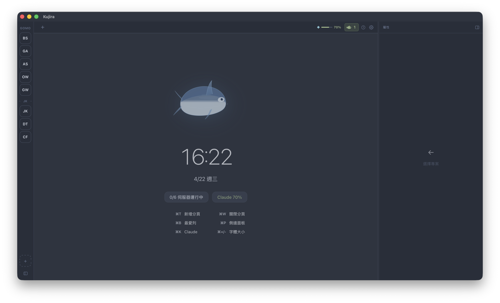

# Kujira（鯨）

[English](#english) | [繁體中文](#繁體中文)

---

## English

> A macOS native developer terminal — multi-tab terminal, dev server management, Claude AI usage monitoring, Git operations, and Gemini AI command suggestions.

Built with **Tauri 2 + React 18 + xterm.js**, designed for daily development workflows.



### Features

* **Multi-tab Terminal** — xterm.js + PTY, supports shell, server log, and Claude monitor tab types with CJK IME optimization
* **Claude AI Usage Monitoring** — Real-time JSONL log parsing, displays daily token consumption, cost, and quota status
* **Gemini AI Command Suggestions** — Type `? question` to get shell command suggestions
* **Git Operations Panel** — status, commit, branch, push/pull — all Git operations without leaving the window
* **Dev Server Management** — Start/stop servers with PID persistence, properly reclaims stale processes after app crashes
* **Claude Code Hooks Integration** — Real-time tracking of Claude agent status (working / idle / pending)
* **Auto Update** — Built-in update checker, one-click install from Settings

### Download

Go to [Releases](https://github.com/JakeChang/Kujira/releases/latest) to download the latest DMG.

Supports macOS 15+ / Apple Silicon & Intel.

On first launch, run:

```
xattr -cr /Applications/Kujira.app
```

### Development

```bash
npm install
npm run tauri dev   # Dev mode (Rust + React start together)
npm run tauri build # Build .app
```

**Requirements:** Node.js >= 18, Rust stable, macOS 15.0+

### License

MIT

---

## 繁體中文

> macOS 原生開發終端機，整合多分頁終端、開發伺服器管理、Claude AI 用量監控、Git 操作與 Gemini AI 指令建議。

基於 **Tauri 2 + React 18 + xterm.js** 打造，專為日常開發工作流設計。


### 功能

* **多分頁終端** — xterm.js + PTY，支援 shell、server log、Claude 監控三種分頁類型，中文 IME 最佳化
* **Claude AI 用量監控** — 即時讀取 JSONL 記錄，顯示每日 token 消耗、費用與 quota 狀態
* **Gemini AI 指令建議** — 輸入 `? 問題` 即可獲得 shell 指令建議
* **Git 操作面板** — status、commit、branch、push/pull，不離開視窗完成所有 Git 操作
* **開發伺服器管理** — 啟停伺服器，PID 持久化，App 崩潰重啟後能正確回收殘留行程
* **Claude Code Hooks 整合** — 即時追蹤 Claude agent 狀態（working / idle / pending）
* **自動更新** — 內建更新檢查，設定頁面一鍵安裝最新版本

### 下載

前往 [Releases](https://github.com/JakeChang/Kujira/releases/latest) 下載最新版 DMG。

支援 macOS 15+ / Apple Silicon & Intel。

首次安裝需執行：

```
xattr -cr /Applications/Kujira.app
```

### 開發

```bash
npm install
npm run tauri dev   # 開發模式（Rust + React 同時啟動）
npm run tauri build # 建置 .app
```

**需求：** Node.js >= 18、Rust stable、macOS 15.0+

### License

MIT
